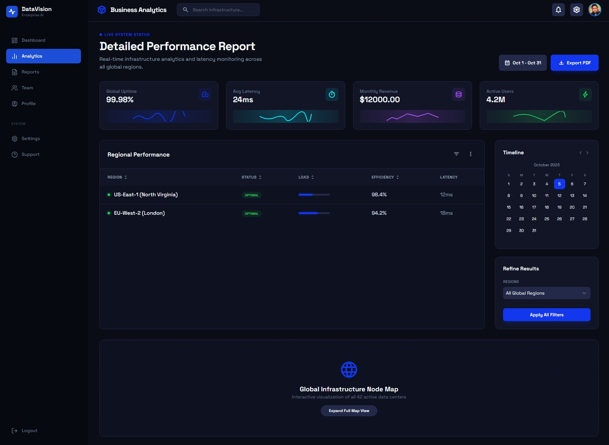
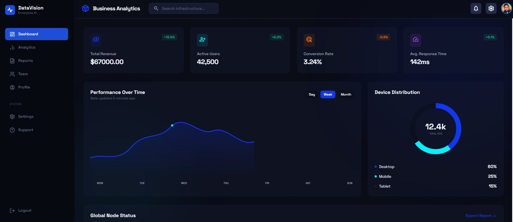
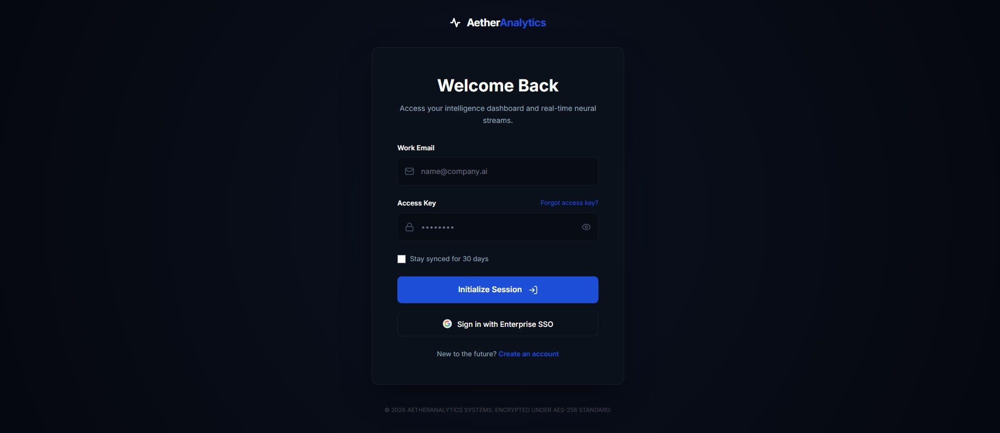
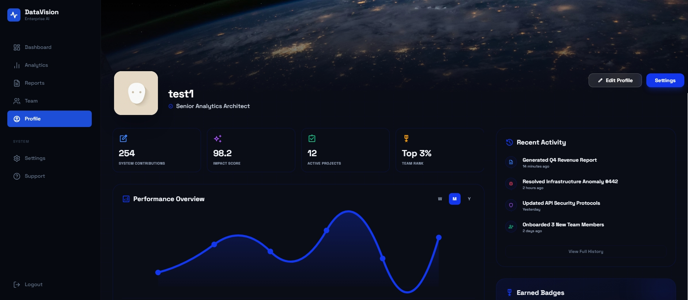

# 📊 Business Analytics Dashboard

A full-stack Business Analytics platform designed to visualize and manage key performance indicators (KPIs) through interactive dashboards.

---

## 🚀 Features

* 📈 Interactive charts using Recharts
* 🔐 Secure authentication with JWT & Bcrypt
* 🧭 Smooth navigation with React Router
* 📊 Real-time analytics dashboard
* 💾 MySQL database integration

---

## 🛠️ Tech Stack

### Frontend

* React + Vite
* Recharts
* React Router
* Lucide Icons

### Backend

* Node.js
* Express.js
* MySQL
* JWT Authentication
* Bcrypt

---

## 📂 Project Structure

```
/client   → Frontend (React)
/server   → Backend (Node.js API)
```

---

## ⚙️ Installation

### 1. Clone the repository

```
git clone https://github.com/your-username/business-analytics-dashboard.git
```

### 2. Install dependencies

#### Frontend

```
cd client
npm install
npm run dev
```

#### Backend

```
cd server
npm install
npm start
```

---

## 🔐 Environment Variables

Create a `.env` file in the server folder:

```
DB_HOST=your_host
DB_USER=your_user
DB_PASSWORD=your_password
JWT_SECRET=your_secret
```

---

## 📸 Screenshots

📸 Screenshots

**Analytics Page**  


**Dashboard Page**  


**Login Page**  


**Profile Page**  


---

## 👨‍💻 Author

Mohamed OUABEN
